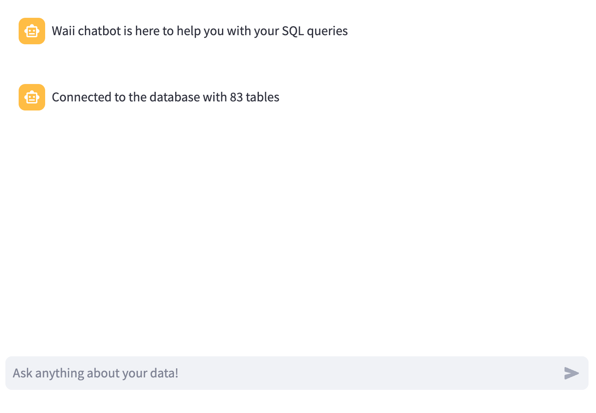

# Build a SQL bot

Now you will build a SQL bot that will create SQL queries to answer a qeustion.

First of all, you need to create a new bot implementation.

## Start SQLChatbot

First, create a new file to support the SQL bot under the `bots` folder. (you can name it `my_sql_chatbot.py`). There's a `sql_chatbot.py` file already, you can use it directly if you want to skip the coding.

```python
# my_sql_chatbot.py
class SQLChatbot(BasicChatbot):
    ...
```

And add the following code:

```python
from waii_sdk_py.chat import *
from waii_sdk_py.query import *

from bots.basic_chatbot import BasicChatbot
from display import *
from utils import initialize_waii_client_if_needed

class SQLChatbot(BasicChatbot):
    def __init__(self):
        initialize_waii_client_if_needed()

    def create_answer(self, user_query):
        waii = initialize_waii_client_if_needed()

        # get parent_uuid from session state
        parent_uuid = None
        if 'parent_uuid' in st.session_state:
            parent_uuid = st.session_state['parent_uuid']

        response = waii.chat.chat_message(ChatRequest(ask=user_query, modules=["query"], parent_uuid=parent_uuid))

        # update parent_uuid in session state
        st.session_state['parent_uuid'] = response.chat_uuid

        # display without formatting
        output_message = chat_response_to_assistant_output(response)
        display_answer(output_message, 'assistant', True)
```

It create a Waii SDK client, and then send the user query to the WAII SDK `chat_message` method. (See https://doc.waii.ai/python/docs/chat-module#chat-message)

The response is then displayed in the chatbot window (use the `display_answer` function to render the response).

And inside main.py, use the new bot:

```python
if __name__ == "__main__":
    #bot = BasicChatbot() <-- comment this line
    bot = SQLChatbot() <-- uncomment this line
    ...
```

## Try it

Just run the following command:

```
export WAII_API_SERVER_URL="https://sql.dev.waii.ai/api/"
export WAII_API_KEY=<use the waii api key you received>
export DATABASE_CONNECTION_KEY='snowflake://WAII_USER@gqobxjv-bhb91428/MOVIE_DB?role=WAII_USER_ROLE&warehouse=COMPUTE_WH'
LOG_LEVEL=DEBUG streamlit run main.py
```

You should be able to see a screen like this



Now you can ask questions like:

```
Give me the number of actors for each movie
```

```
Give me movies which won the most awards
```

You should be able to see SQL responses.

This is basic SQL bot, and it doesn't execute the query yet. We will do that in the next step.

## Next steps

Add data & visualization to the SQL bot. Go to the next step [2_data_visulization_bot.md](2_data_visulization_bot.md)
