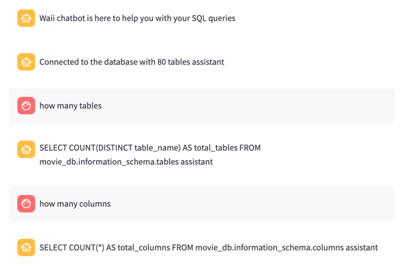

# Build a SQL bot

Now you will build a SQL bot that will execute SQL queries and return the results.

First of all, you need to create a new bot implementation.

## Start SQLChatbot

First create a new bot under the `bots` folder.

```python
import os

import streamlit as st
from waii_sdk_py.query import *
from bots.basic_chatbot import BasicChatbot
from constants import Envs
from display import *

class SQLChatbot(BasicChatbot):
    def initialize_waii_client_if_needed(self):
        if 'waii_sdk_client' not in st.session_state:
            # Initialize the WAII SDK client
            # add code here
        else:
            return st.session_state['waii_sdk_client']

    def __init__(self):
        self.initialize_waii_client_if_needed()

    def create_answer(self, user_query):
        waii = self.initialize_waii_client_if_needed()
```

And inside main.py, use the new bot:

```python
if __name__ == "__main__":
    #bot = BasicChatbot() <-- remove this line
    bot = SQLChatbot()
    ...
```

## Add initialize WAII SDK client

```python
    def initialize_waii_client_if_needed(self):
        if 'waii_sdk_client' not in st.session_state:
            waii = Waii()

            # check if we have the API server URL and API key
            if Envs.ENV_WAII_API_SERVER_URL not in os.environ:
                raise ValueError(f"Environment variable {Envs.ENV_WAII_API_SERVER_URL} is not set")

            if Envs.ENV_WAII_API_KEY not in os.environ:
                raise ValueError(f"Environment variable {Envs.ENV_WAII_API_KEY} is not set")

            if Envs.ENV_DATABASE_CONNECTION_KEY not in os.environ:
                raise ValueError(f"Environment variable {Envs.ENV_DATABASE_CONNECTION_KEY} is not set")

            waii.initialize(url=os.environ[Envs.ENV_WAII_API_SERVER_URL], api_key=os.environ[Envs.ENV_WAII_API_KEY])
            waii.database.activate_connection(os.environ[Envs.ENV_DATABASE_CONNECTION_KEY])
            st.session_state['waii_sdk_client'] = waii
```

We load the WAII API server URL, API key, and database connection key from the environment variables.

And then initialize the waii Python SDK client with the API server URL and API key.

Streamlit session state is used to store the WAII SDK client object. This is to avoid creating a new client object for each user query.

## Add a sanity test to check if the WAII SDK client is working

Under `SQLChatbot` class, add the following code:

```python
    @staticmethod
    def _sanity_test(waii):
        # after connection, we can do a sanity tests, to show how many tables we have
        response = waii.database.get_catalogs()
        n_tables = 0
        for catalog in response.catalogs:
            for schema in catalog.schemas:
                for _ in schema.tables:
                    n_tables += 1
        with st.chat_message('assistant'):
            display_answer(f"Connected to the database with {n_tables} tables", 'assistant', True)
```

Basically, this uses the WAII SDK `get_catalogs()` to get the number of tables in the database. (See https://doc.waii.ai/python/docs/database-module#get-catalogs)
This will print the number of tables in the database.

## Add the SQL query generation 

```python

    def create_answer(self, user_query):
        waii = self.initialize_waii_client_if_needed()

        # now based on the user query, we generate the answer
        generated_query = waii.query.generate(QueryGenerationRequest(ask=user_query))

        display_answer(generated_query.query, 'assistant', True)
```

This code generates the SQL query based on the user query using the WAII SDK `generate()` method. (See https://doc.waii.ai/python/docs/sql-query-module#generate-query)

## Run it!

```
export WAII_API_KEY='abc123............xxxxxxxxx'
export WAII_API_SERVER_URL="https://.../api/"
export DATABASE_CONNECTION_KEY='snowflake://...'

LOG_LEVEL=DEBUG streamlit run main.py
```

You should be able to see the number of tables as part of the welcome message, and you can ask questions like:

```
give me how many actors for each movie
```

And you can see the generated SQL query.

```
SELECT
    m.asset_title,
    COUNT(DISTINCT ab.people_id) AS number_of_actors
FROM movie_db.movies_and_tv.movies AS m
INNER JOIN movie_db.movies_and_tv.movies_actors_bridge AS ab
    ON m.movie_id = ab.movie_id
GROUP BY
    m.asset_title
```

It looks like

[](screenshots/sql_chatbot.png)

Not very user-friendly, right? Because there's no formatting yet. And the query is not executed yet. We will do that in the next step.

Full implemented code can be found in the `bots/sql_chatbot.py` file.

Next step? [Step 2: Execute query and formatting the output](./2_sql_bot_with_results.md)
