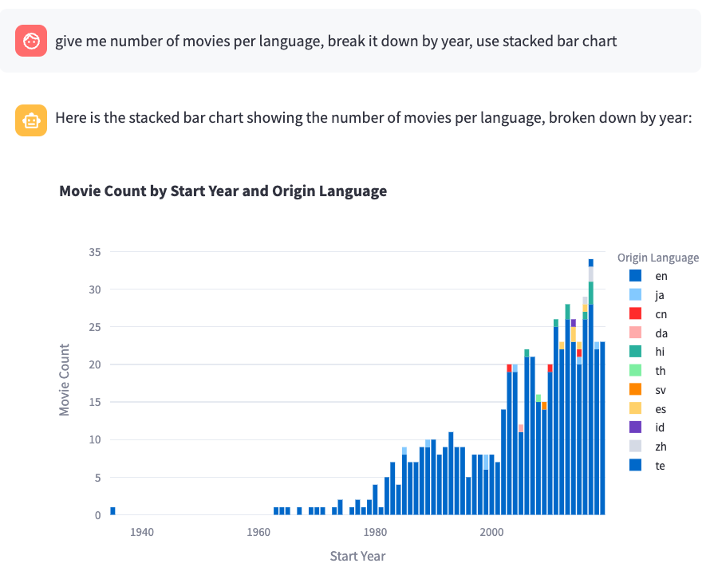

# Build a data and visualization bot

Now you know how to build a SQL bot, let's add data and visualization capabilities to the bot.

You can just add more "modules" to the `modules` list in the `chat_message` method. For example, to add data and visualization capabilities, you can add the `data` and `plot` modules.

In side `bots/sql_chatbot.py`, change the `create_answer` method to include the `data` and `plot` modules:

From this:

```python
...
response = waii.chat.chat_message(ChatRequest(ask=user_query, modules=["query"], parent_uuid=parent_uuid))
```

Change it to:

```python
...
response = waii.chat.chat_message(ChatRequest(ask=user_query, modules=["query", "data", "plot"], parent_uuid=parent_uuid))
```

Try it out by kill the current running chatbot and run it again.

```
LOG_LEVEL=DEBUG streamlit run main.py
```

Now you can ask the bot to plot a chart for you. For example: `give me number of movies per language, break it down by year, use stacked bar chart`



The Waii chat server will choose what's the best chart to display based on the ask, it can be a sql, data, or plot. 

For example if you ask: `which SQL query can i use to answer 'how many movies per genre'`

You should only get a SQL back as the response.

## Available modules for the chatbot

- `query`: This module is used to answer SQL queries.
- `data`: This module is used to answer data related questions.
- `plot`: This module is used to answer visualization related questions.
- `tables`: This module is used to answer database metadata related questions, such as table names, column names, etc.

## Behind-the-scene tour for data and visualization

Don't want to overly simplify these modules. For Waii, it will involve a lot of planning, function selection, to make it work. 

When there're multiple modules specified, Waii will try to find a way to answer the question based on the available modules (internally it looks like function spec). And it will choose the best one to answer the question.

If the question cannot be answered by the current module, or the question cannot be answered by the database schema, it will return a message like "I'm sorry, I cannot answer this question".

There're two special modules will be activated regardless of the modules specified in the `chat_message` method:

- `no-op`: which is used to respond to user input which doesn't need any processing. For example: `hi`, `hello`, `how are you`, etc.
- `reject`: which is used to respond to user input which is not supported by the chatbot, or improper question (profanity, etc.)

## Bonus: enter the `tables` module

We didn't enable the tables module, but you can try to enable it by adding it to the `modules` list in the `chat_message` method.

```
response = waii.chat.chat_message(ChatRequest(ask=user_query, modules=["query", "data", "plot", "tables"], parent_uuid=parent_uuid))
```

Now you can ask the bot about the database, such as "Tell me more about the tables in the database", "What can i do with the movies schema", etc.

Best practice is to enable only the modules you need, because it will take more time to process the question if you enable more modules. Also it can potentially cause confusion if the question can be answered by multiple modules.