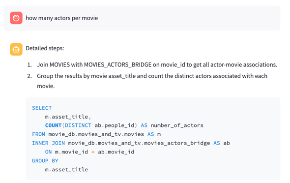
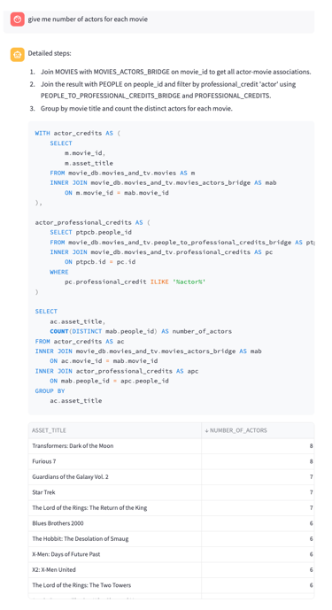

# Upgrade the SQL Bot with Results

The previous bot is able to generate SQL queries based on the user input. Now, let's upgrade it to execute the generated SQL query and display the results.

To avoid duplicating the code, we will create a new class called `SQLChatbotWithResult`, which extends the `SQLChatbot` class. This new class will implement the `create_answer` method to execute the SQL query and display the results.

## First let's show the detailed steps of the SQL query

For every generated query, Waii generates "detailed steps" which is intended for human readability. We will display this information before the SQL query and the results.

Please note that we now use AssistantOutput and AssistantMessage to display the information. This is a small wrapper to allow the Streamlit chatbot to display the information in a more readable way.

```python
    def create_answer(self, user_query):
        waii = self.initialize_waii_client_if_needed()

        # now based on the user query, we generate the answer
        generated_query = waii.query.generate(QueryGenerationRequest(ask=user_query))

        # display with formatting (sql, steps, data)
        display_answer(AssistantOutput(messages=[
                        AssistantMessage(content=generated_query.detailed_steps, type=AssistanntMessageType.Step),
                        AssistantMessage(content=generated_query.query, type=AssistanntMessageType.SQL)
                    ]),
            'assistant', True)
```

Again, you need to update the `main.py` to use the new bot:

```python
bot = SQLChatbotWithResult()
```

You should be able to see the detailed steps and the formatted SQL query.



## Get query results, and display it

Now, let's execute the generated SQL query and display the results.

You can use the `run()` of `generated_query` object, and convert the result to pandas dataframe

```
df = generated_query.run().to_pandas_df()
```

And then, we add the dataframe display to the output message

```python
display_answer(AssistantOutput(messages=[
                            AssistantMessage(content=generated_query.detailed_steps, type=AssistanntMessageType.Step),
                            AssistantMessage(content=generated_query.query, type=AssistanntMessageType.SQL),
                            AssistantMessage(content=df, type=AssistanntMessageType.Data)
                       ]),'assistant', True)
```

Now, you should be able to see the detailed steps, the SQL query, and the results.

Final source code is available at [bots/sql_chatbot_with_result.py](../bots/sql_chatbot_with_result.py)

It looks like: 



## Next step?

Now that you have a SQL bot that can generate SQL queries, execute them, and display the results. You may want to update the query, ask to fix the query, etc. let's move to the next step.

[Step 3: SQL bot with capability to update the query](./3_sql_bot_with_update.md)